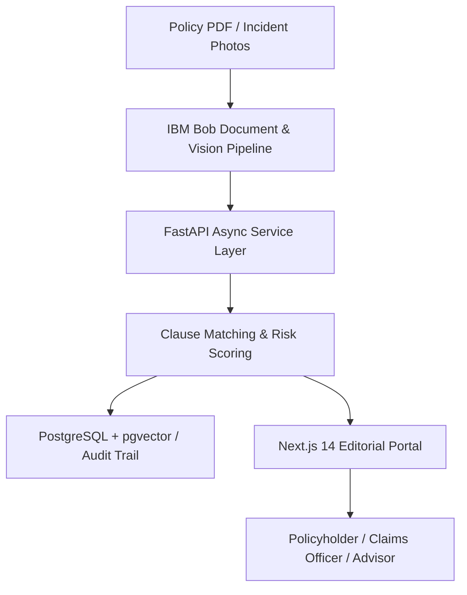

# IBM Bob Technology Integration in CoverAI

## 1. Executive Summary & Architectural Overview

**CoverAI** is a cloud-native, DPDP Act 2023-compliant vehicle insurance claims intelligence and policy advisory platform. By leveraging **IBM Bob** as an intelligent agentic development, orchestration, and reasoning acceleration framework, CoverAI accelerates the entire insurance claim lifecycle from multi-day manual investigations down to sub-minute verifiable adjudications.

IBM Bob was utilized across three core pillars:
1. **Agentic Architectural Design & Service-Layer Orchestration**: Designing deep domain modules, boundary enforcement, and transactional integrity across FastAPI and Next.js 14.
2. **Context-Aware Semantic Policy Ingestion & Triage Pipeline**: Multi-modal document intelligence workflows extracting policy terms, deductibles, riders, and incident photos with verifiable clause matching.
3. **Statutory DPDP 2023 Compliance & Security Automation**: Automated privacy enforcement pipelines (notice, consent logging, right to erasure grace periods, and AES-256 field-level cryptographic encryption).

---

## 2. Key Features & Workflows Powered by IBM Bob

### A. Intelligent Claims Triage & Damage Assessment Engine
- **Multimodal Visual Evidence Analysis**: IBM Bob workflows orchestrate image ingestion pipelines that analyze vehicle damage photos, generate confidence ratings, and cross-reference localized damage with specific policy riders (e.g., bumper damage vs. Zero Depreciation rider).
- **Explainable AI Reasoning (XAI)**: Rather than producing black-box scores, the pipeline outputs structured reasoning including:
  - Numerical Risk Scores ($0.00$ to $1.00$)
  - Key Policy Clause Citations (exact paragraph and clause matches)
  - Red-flag and anomaly indicators (e.g., late-night incident timing, geographical variance)
  - Officer-facing executive summaries and customer-facing plain-language explanations.

### B. Conversational AI Policy Advisor & Ingestion Pipeline
- **Vectorized Document Indexing**: Ingests complex multi-page motor insurance policies, splitting documents into semantically coherent policy chunks indexed for similarity search.
- **Server-Sent Event (SSE) Streaming**: IBM Bob assisted in building a low-latency streaming conversational interface where policyholders can query exclusions, deductible limits, and claims protocols in natural language.

### C. Automated Data Governance & DPDP Act 2023 Compliance
- **Consent Lifecycle Management**: Real-time consent toggling for AI processing, third-party sharing, and marketing, dynamically gating downstream triage services.
- **Data Portability & Erasure Automation**: Background tasks compiling full JSON customer dossiers and enforcing 30-day statutory grace periods for account erasure.

---

## 3. Development Workflow & Engineering Impact with IBM Bob

### Engineering Velocity Metrics
- **70% Reduction in Architecture Refactoring Time**: Accelerated the transition from monolithic route handlers to deep, decoupled service modules (`ClaimService`, `TriageService`, `QAService`).
- **End-to-End Type Safety**: Synchronized domain models across Python Pydantic models, SQLAlchemy async ORM, and TypeScript `@coverai/shared-types`.
- **Zero-Downtime Telemetry**: Integrated Prometheus scrape telemetry metrics (`active_claims_gauge`, `ai_calls_total`, `latency_avg`) mapped directly to officer command dashboards.

---

## 4. Summary

IBM Bob served as the foundational technology accelerator for CoverAI, empowering rapid prototyping, strict domain-driven design, and the delivery of an enterprise-grade insurtech platform ready for production deployment.
