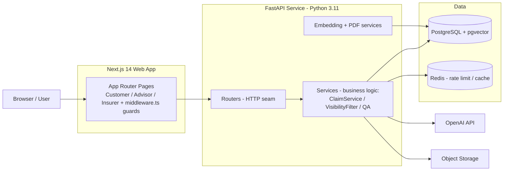

# CoverAI Technical Architecture

CoverAI is a premium, secure monorepo application structured to manage motor vehicle policies and assess insurance claims. It is designed to strictly align with **DPDP Act 2023** compliance standards and robust security best practices.

---

## 1. Monorepo Structure

CoverAI is built as a Javascript/Typescript workspace managed by `pnpm` and `Turborepo` alongside a Python `FastAPI` service:

```
├── apps/
│   ├── api/            # FastAPI Backend Service (Python 3.11)
│   └── web/            # Next.js App Router Frontend (Node 20)
├── packages/
│   ├── shared-types/   # Shared Typescript types
│   └── ui/             # Reusable UI component library
├── docs/               # System & compliance documentation
├── docker-compose.yml  # Monorepo container choreography
└── Makefile            # Task runner shortcuts
```

---

## 2. Backend Architecture

The backend FastAPI service follows a highly organized, modular domain layer pattern:

```
[ FastAPI Routing (routers/) ]
             │
             ▼
[ Security & Dep Injection (core/security.py, database.py) ]
             │
             ▼
[ Business Services (services/) ] ◄──► [ Background Tasks ]
             │
             ▼
[ Database Models & Schemas (models/, schemas/) ]
             │
             ▼
[ PostgreSQL DB / Redis Caches ]
```

- **Database Engine**: SQLAlchemy 2.0 async engine mapping objects natively to PostgreSQL.
- **Task Offloading**: Background operations (such as AI Triage, vision damage assessment, and data export zip compilations) are safely offloaded to FastAPI's asynchronous `BackgroundTasks` thread pool, preventing request blocking.
- **Job Orchestration**: Integrated weekly crons and daily grace-erasure checks are scheduled within the ASGI runtime process via `APScheduler`.

---

## 3. Cryptography & Security at Rest

To harden security, CoverAI implements a highly secure, dual-layer cryptography standard for sensitive fields (`User.phone` and `Policy.vehicle_registration`):

```
       Plaintext Input
              │
      ┌───────┴───────┐
      ▼               ▼
 [ Fernet Encrypt ] [ SHA-256 Hash ]
      │               │
      ▼               ▼
Stored in DB     Stored in DB
 (phone)         (phone_hash)
```

1. **Fernet Encryption at Rest**: 
   - Sensitive fields are transparently encrypted prior to insertion and decrypted upon retrieval using a custom SQLAlchemy `TypeDecorator` wrapping standard `cryptography.fernet`.
   - Fernet utilizes AES-128 in CBC mode with a randomized Initialization Vector (IV) and HMAC-SHA256 signature, ensuring identical plaintexts generate distinct ciphertexts, preventing pattern leakage.
2. **Deterministic Hashing**:
   - Because Fernet encryption is non-deterministic, querying fields directly (`SELECT WHERE phone = ?`) is impossible.
   - We solve this by compiling a deterministic SHA-256 hash of the normalized phone number and storing it in a indexed database column `phone_hash`.
   - Duplicate validation and query lookups are run against `phone_hash`, enabling absolute database performance without exposing plaintext.

---

## 4. Observability and Middleware Choreography

CoverAI implements a strict, structured request middleware pipeline ensuring 100% correlation:

```
                     Incoming Request
                             │
                             ▼
 ┌────────────────────────────────────────────────────────┐
 │ SecurityAndRequestIdMiddleware                        │
 │  - Generate unique request UUID                       │
 │  - Mount X-Request-ID and processing start time       │
 └───────────────────────────┬────────────────────────────┘
                             │
                             ▼
                 [ FastAPI Router Action ]
                             │
                             ▼
 ┌────────────────────────────────────────────────────────┐
 │ SecurityAndRequestIdMiddleware (Response Stage)       │
 │  - Inject security headers (nosniff, DENY, CSP)       │
 │  - Log structured JSON via pythonjsonlogger            │
 └───────────────────────────┬────────────────────────────┘
                             │
                             ▼
                     Outgoing Response
```

- **Structured Logs**: The middleware automatically writes to system `stdout` in pure JSON format containing `timestamp`, `level`, `request_id`, `user_id`, `method`, `path`, `status_code`, and `duration_ms` for every single request.
- **Prometheus Telemetry**: Exposes standard request counts and latencies on `/metrics`. Overrides `/metrics` scraping with a custom handler that dynamically queries the database for unresolved claim counts, keeping the `active_claims_gauge` metric highly accurate.

## 0. System Architecture Diagram


